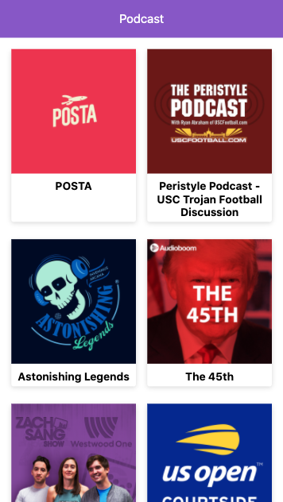
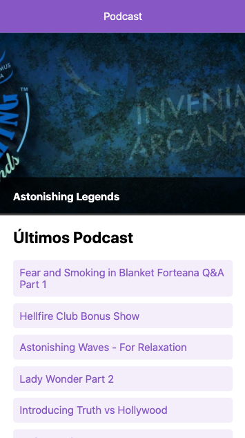
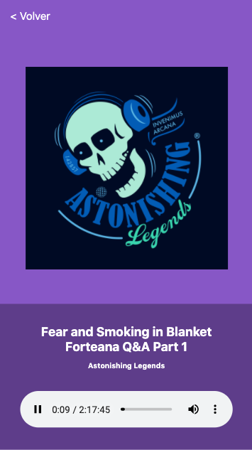

# Curso de Next JS - Platzi Podcast

App de Pordcast integrada con la API de AudioNoom para aprendert Next.JS

[Ver la aplicación](https://platzi-podcast-lars.vercel.app/)

## ¿Cómo funciona?

Requirer Node.JS 10

* `npm install` para instalar las dependencias.
* `npm run dev` para iniciar el entorno de desarrollo.
* `npm run build && npm start` para el iniciar el entorno de producción.

## Licencia

MIT